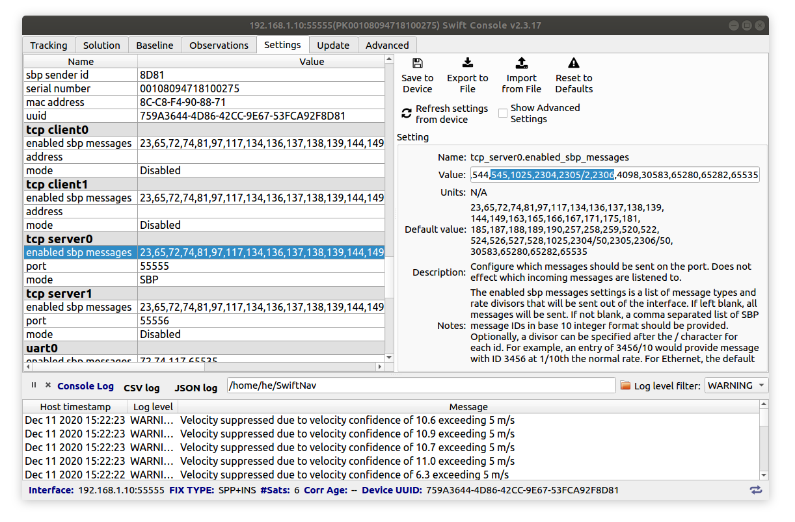
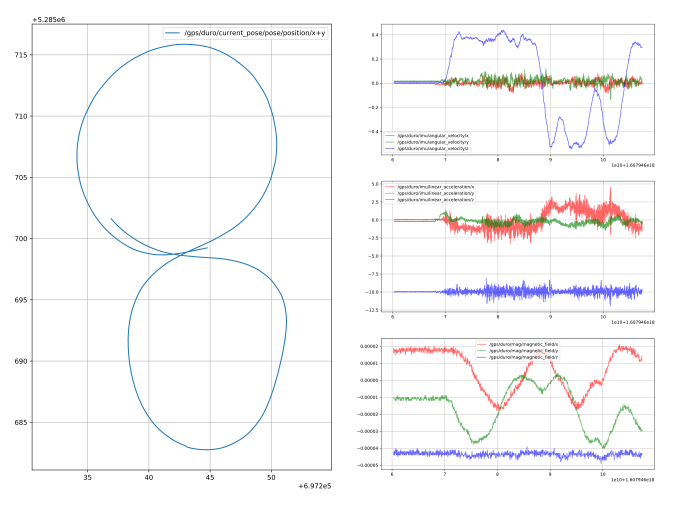

# Duro Inertial GPS ROS2 Driver

## Overview

This is a C++ ROS driver for Swiftnaw Duro Inertial (Piksi Multi Inertial) GPS / GNSS Receivers. The code is based on offical Swiftnav libswiftnav C example. **Note** that orientation data is produced by Duro Inertial but not produced by Piksi Multi or Duro. Ref.: https://github.com/szenergy/duro_gps_driver/tree/ros2-humble

## Scope
The current version supports *only* (not tested elsewhere):
- Ubuntu 20.04 and 22.04
- ROS2 Foxy and Humble
- Catkin tools https://catkin-tools.readthedocs.io/ (Colcon) 
- Only ethernet version (no serial or USB support)

## Install
### 1. Dependencies
Install libsbp (Swift binary protocol library) C client library from GitHub: https://github.com/swift-nav/libsbp. The tested version can be found in the branch fe7b78992fb87eef5bd6d12b2daf70f4ac90bc39.
It is detailed in github, but the main steps are:
```
sudo apt-get install build-essential pkg-config cmake doxygen check
cd ~; mkdir git; cd git     # eg create a git folder, the folder name can be different
git clone https://github.com/swift-nav/libsbp.git
cd libsbp
git checkout fe7b78992fb87eef5bd6d12b2daf70f4ac90bc39
cd c
git submodule update --init --recursive
mkdir build; cd build
cmake ../
make
sudo make install
```
This will create some files in `/usr/local/include/libsbp/` and in `/usr/local/lib`.

### 2. ROS 2 package
Clone the duro_gps_driver package into your workspace. 
Navigate to the root of your workspace. Source your setup.bash file. Build the `duro_gps_driver` package using Colcon:
``` bash
colcon build --packages-select duro_gps_driver
```

## Settings 
Enable MSG ID 544 and 545 in swift console. Once again, orientation data not produced by Piksi Multi or Duro. These orientation messages are not enabled in default configuration.
The MSG ID is defined in the headers, e.g. `#define SBP_MSG_ORIENT_QUAT 0x0220` which is decimal `544`.
Also by defult the magnetometer publishes every 50th message. Change `2306/50` to `2306` in swift console (this message in hex is `0x0902`).



## Run
To run the `duro_gps_driver` driver is necessary to provide your device's IP address and port number. You can run with the following command: 
```
ros2 run duro_gps_driver duro_node --ros-args -p ip_address:="192.168.1.10" -p port:=55555
```
Alternatively you can use a [launch](launch/duro_example.launch.xml) file. E.g:
```
ros2 launch duro_gps_driver duro_example.launch.xml
or 
ros2 launch duro_gps_driver duro_example.launch.py
```

## Topics
`duro_ros duronode` publishes the following topics and [types]:
|Topic|Type
|-|-|
`/gps/current_pose` |[`[geometry_msgs/msg/PoseStamped]`](https://docs.ros2.org/foxy/api/geometry_msgs/msg/PoseStamped.html)
`/gps/fix` |[`[sensor_msgs/msg/NavSatFix]`](https://docs.ros2.org/latest/api/sensor_msgs/msg/NavSatFix.html)
`/gps/imu` |[`[sensor_msgs/msg/Imu]`](https://docs.ros2.org/foxy/api/sensor_msgs/msg/Imu.html)
`/gps/mag` |[`[sensor_msgs/msg/MagneticField]`](https://docs.ros2.org/foxy/api/sensor_msgs/msg/MagneticField.html)
`/gps/odom ` |[`[nav_msgs/msg/Odometry]`](https://docs.ros2.org/foxy/api/nav_msgs/msg/Odometry.html)
`/gps/rollpitchyaw` |[`[geometry_msgs/msg/Vector3]`](https://docs.ros2.org/foxy/api/geometry_msgs/msg/Vector3.html)
`/gps/status_flag` |[`[std_msgs/msg/UInt8]`](https://docs.ros2.org/foxy/api/std_msgs/msg/UInt8.html)
`/gps/status_string` |[`[std_msgs/msg/String]`](https://docs.ros2.org/foxy/api/std_msgs/msg/String.html)
`/gps/time_ref` |[`[sensor_msgs/msg/TimeReference]`](https://docs.ros2.org/foxy/api/sensor_msgs/msg/TimeReference.html)


An important topic is `/gps/current_pose` which is `geometry_msgs/msg/PoseStamped` type in UTM (https://en.wikipedia.org/wiki/Universal_Transverse_Mercator_coordinate_system) eg:

``` c
header: 
  seq: 5545
  stamp: 
    secs: 1580388036
    nsecs: 641742448
  frame_id: 'map'
pose: 
  position: 
    x: 697214.762607
    y: 5285721.97968
    z: 0.0
  orientation: 
    x: 0.00819693645462
    y: 0.00343747669831
    z: 0.692575566471
    w: 0.721290563233

```

## Example rosbag
Download a sample rosbag, and also a small script to plot the data [here](https://nbviewer.jupyter.org/github/szenergy/szenergy-utility-programs/blob/master/bag_scripts/plotgpsandimu.ipynb) or alteratively [here](https://github.com/szenergy/szenergy-utility-programs/blob/master/bag_scripts/plotgpsandimu.ipynb).



## Further reading
- Libswiftav: https://github.com/swift-nav/libswiftnav
- Libsbp documentation: https://swift-nav.github.io/libsbp/c/build/docs/html
- Libsbp 2.8.0: [Protocol specification pdf](https://www.swiftnav.com/resource-files/Swift%20Navigation%20Binary%20Protocol/v2.8.0/Specification/Swift%20Navigation%20Binary%20Protocol%20Specification%20v2.8.0.pdf)
- ETH python Piksi ROS drivers: https://github.com/ethz-asl/ethz_piksi_ros
